## F1 Racing Analysis
### Is there a better driver than the winner?
<b> Analysis done by Keith Faunce </b>

#### This is a statistical study done purely for fun and has no implications on Formula 1

 In the world of F1, over the last set of years there has been this "debate". If these winning drivers
(notabely Verstappen & Hamilton) are winning because of their talent, or their car? Lando Norris himself
has even taken part of this, with subtle remarks towards Lewis Hamilton and his car. With situations
like these arising, I've taken it upon myself to measure driver success in a different format. Putting emphasis
on overtakes from Murray Walker's phrase: "catching is one thing, passing is another".  

### Measuring Sucess

<b> How it works </b>

 Driver success is measured using a points system. Points are awarded based upon various metrics from
the race, these metrics can yield positive and negative points. 

<b> The Metrics </b>

 Positive: 

<ul>
  <li>Qualifying placement</li>
  <li>Average lap time</li>
  <li>Fastest lap time</li>
  <li>Laps leading</li>
  <li>Overtakes</li>
</ul>

 Negative: 

<ul>
  <li>Pit stops</li>
  <li>Overtakes</li>
</ul>

#### Point Values

[Calculation Information](point_values/README.md)

#### Data Allocation & Citations

 If you're interested in how I created these outputs, there's an .R file with my comments.
Along with links and credit to the data I used for this study. 

* readme goes here

 

## The Results

<b> Left image: 2024 F1 season results. Right image: 2024 results based on point analysis. </b>

<b> Individual race breakdowns below </b>

<table>
  <tr>
    <td>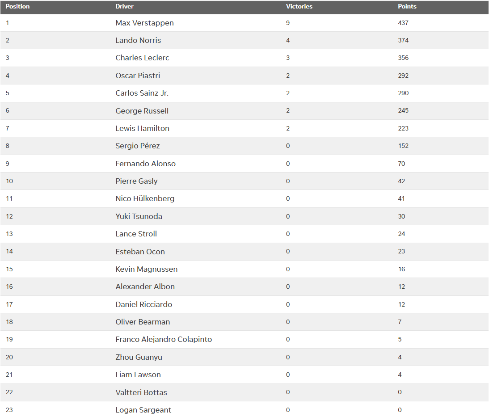</td>
    <td>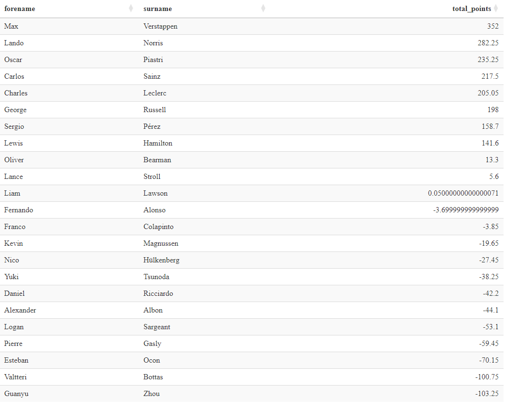</td>
  </tr>
</table>

### Races

<b> Shown table attributes include: </b>
<ul>
  <li>Driver Name</li>
  <li>Overtake points: Typically the most influential category</li>
  <li>Total points: Sum of a drivers points per race</li>
  <li>Race result: Actual position driver finished in</li>
  <li>Point result: Ranks drivers by number of points earned</li>
</ul>

#### Note:
<ul>
  <li>If the overtakes field is blank, that driver had no statistical passing situations</li>
  <li>If race result is marked as R: Driver retired</li>
  <li>If race result is marked as D: Driver disqualified</li>
  <li>This analysis covers the first 21 races of the season</li>
</ul>

### Bahrain

### Saudi Arabia

### Australia

### Japann
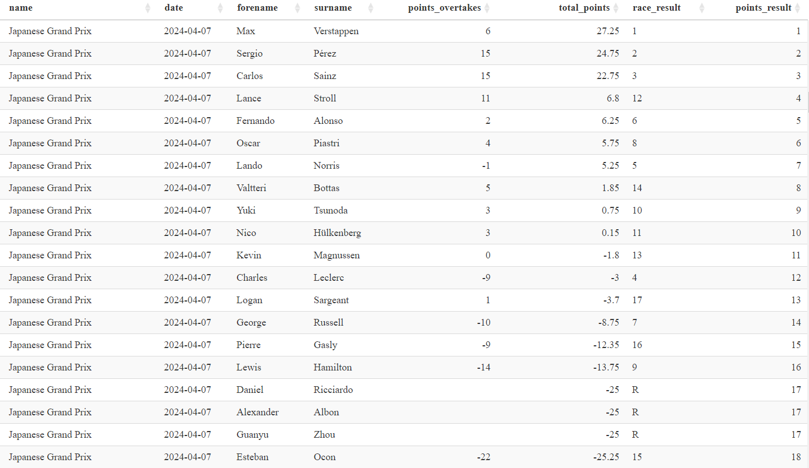

### China

### Miami

### Emilia Romagna
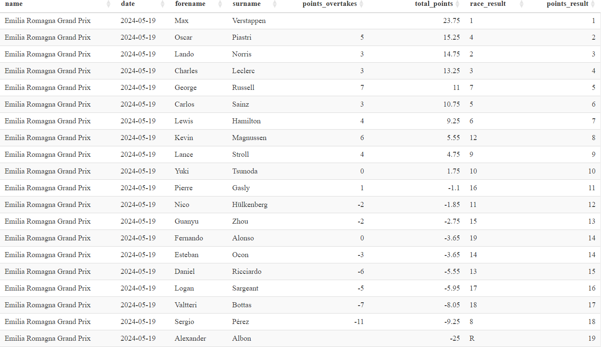

### Monaco

### Canada

### Spain

### Austria
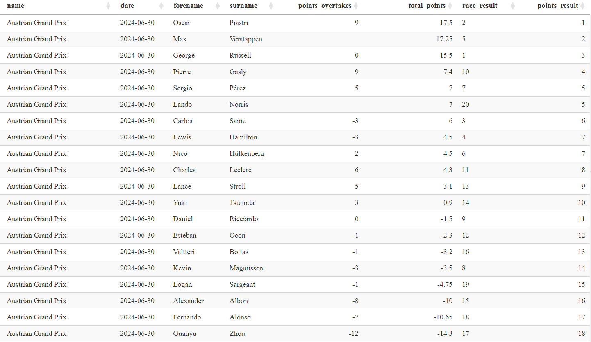

### Britian

### Hungary
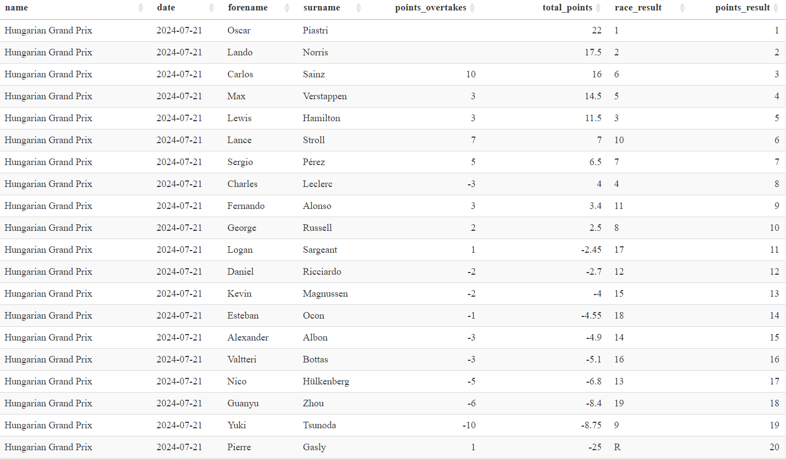

### Belgium
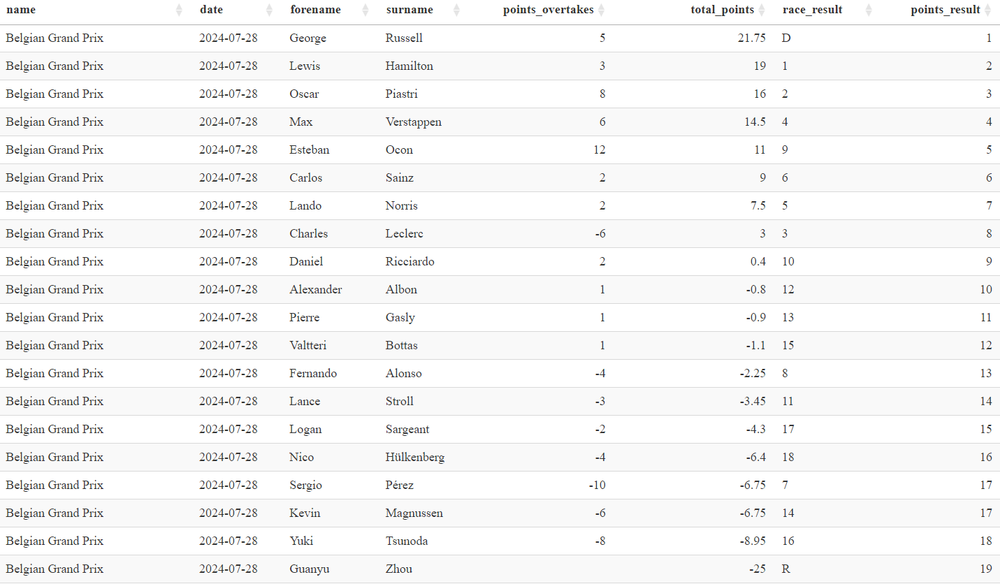

### Netherlands
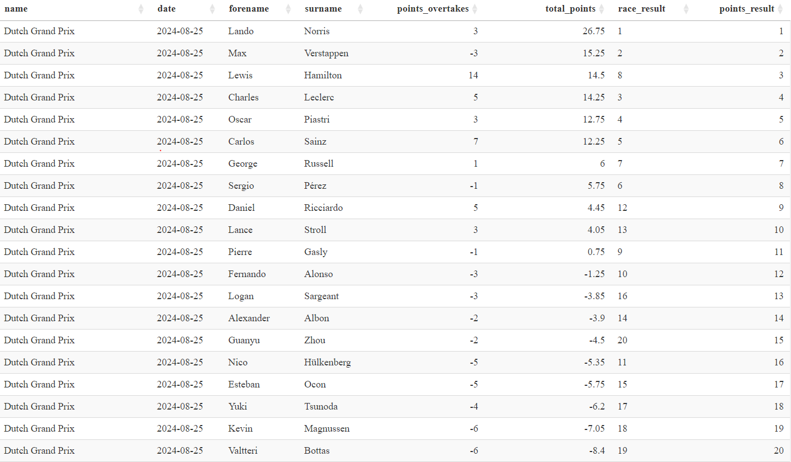

### Italy
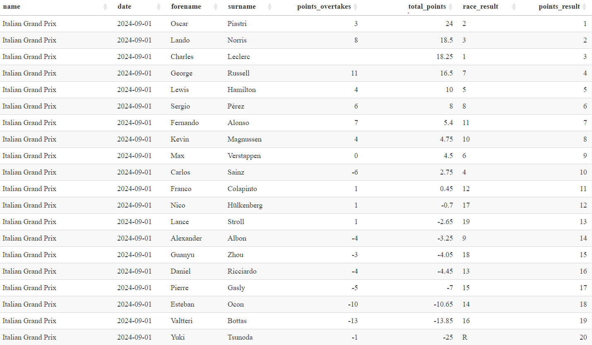

### Azerbaijan
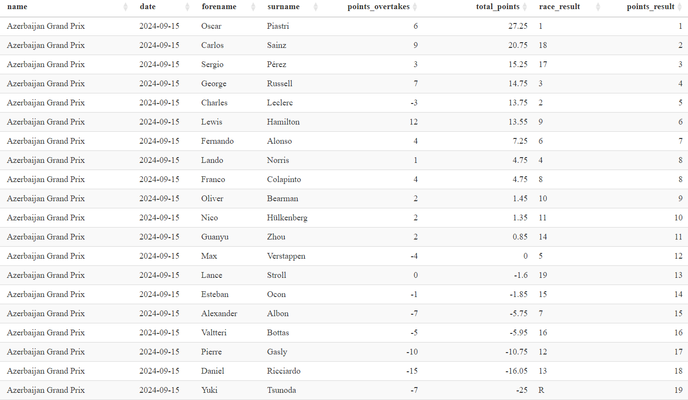

### Singapore
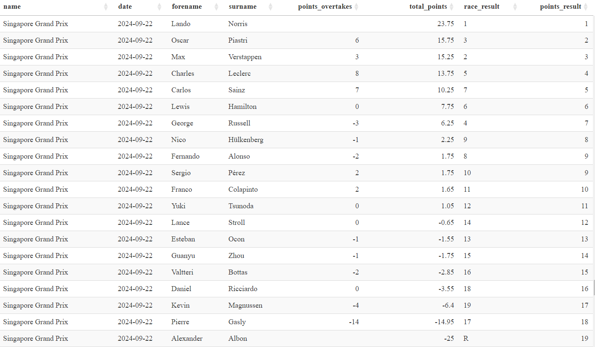

### United States(TX)

### Mexico

### Sao Paulo
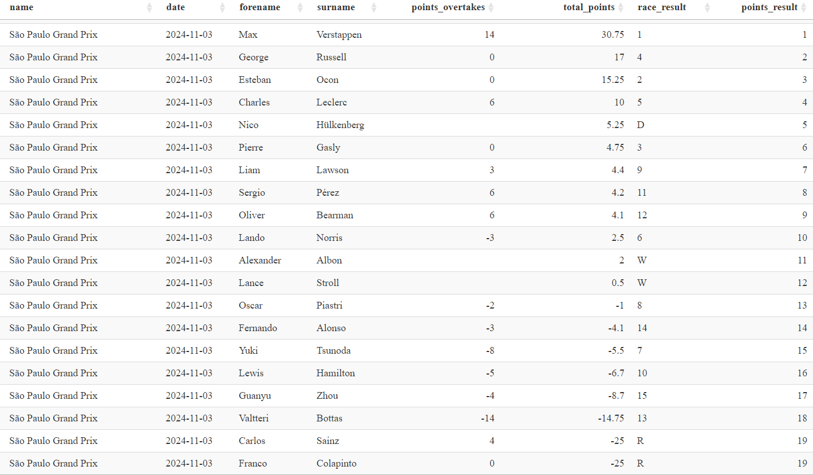
